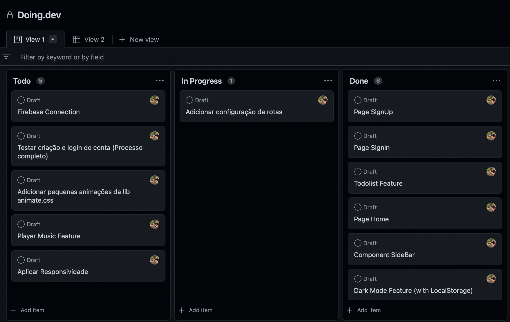
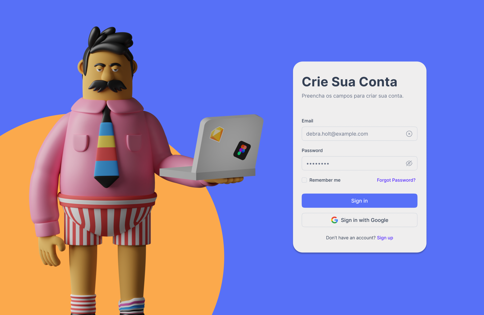
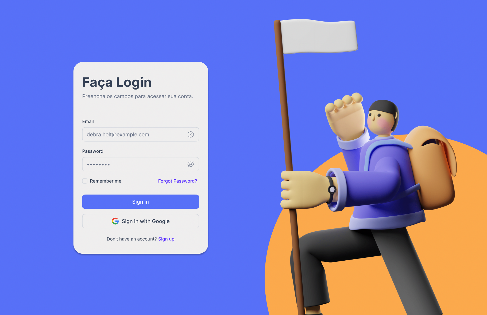
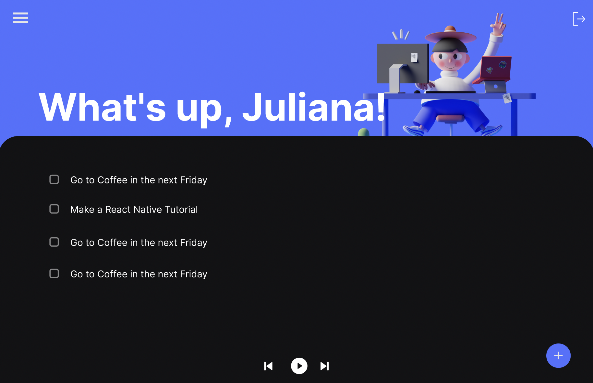
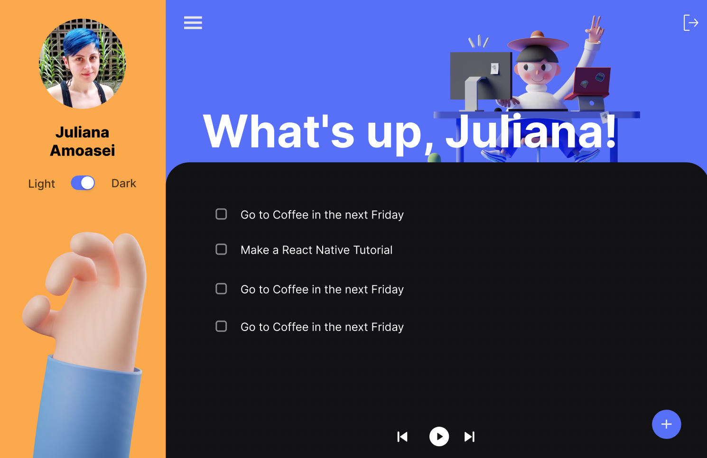
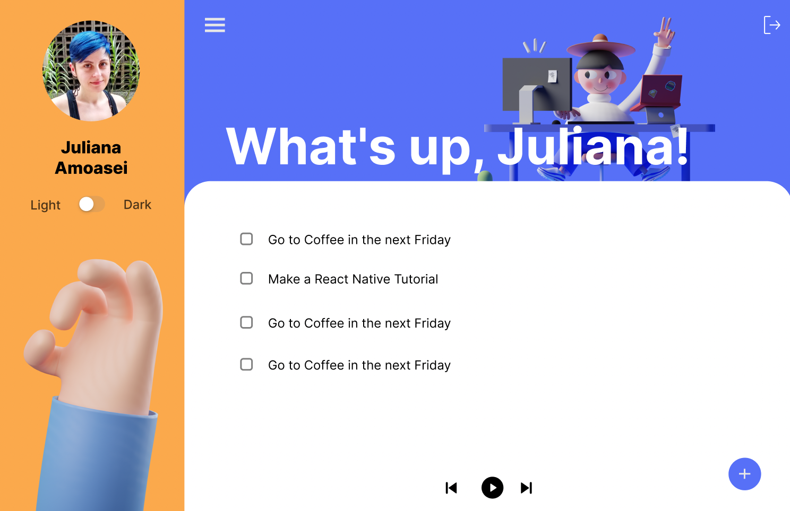

## 🚀 Sobre o Projeto
A ideia do projeto foi para aplicar, práticar e melhorar minhas habilidades técnicas em desenvolvimento web com React, Firebase e mais tecnologias que envolvendo a concepção, desenvolvimento e entrega do produto.

## 💡 Ideia
O projeto tem o objetivo final de ser um todoist mininalista com Lofi Music Player.

## 🚀 Live Preview
Acesse o projeto: [Live Preview](https://doing-dev.vercel.app)

## 🚀 Figma
O design foi desenvolvido do zero por mim e você pode acessar em: [Figma](https://www.figma.com/file/tID5banMXZwmzG4rwFNW6Z/todo.dev?node-id=0%3A1)

## 🚀 Novas versões
Conforme vou adquirindo novas habilidades, irei atualizando o projeto em novas versões. 

## 🚀 Tecnologias utilizadas
- HTML/CSS
- Javascript
- React
- Firebase (Firestore e Auth)
- LocalStorage
- NPM / NPX
- React Router DOM
- MUI Lib para ícones
- Animate.css
- Github Projects
- Vercel

## 🚀 Tarefas para completar o projeto no Github Projects (Screenshot do momento em desenvolvimento).

##

# Doing.dev

O projeto tem o objetivo final de ser um todoist mininalista com Lofi Music Player.

| :placard: Vitrine.Dev |     |
| -------------  | --- |
| :sparkles: Nome        | **Doing.dev**
| :label: Tecnologias | Javascript, ReactJS, CSS, HTML, Firebase, Vercel (tecnologias utilizadas)
| :rocket: URL         | https://doing-dev.vercel.app/
| :fire: Desafio     | https://github.com/FilipiRafael/doing.dev

<!-- Inserir imagem com a #vitrinedev ao final do link -->

## Detalhes do projeto

A ideia do projeto foi para aplicar, práticar e melhorar minhas habilidades técnicas em desenvolvimento web com React, Firebase e mais tecnologias que envolvendo a concepção, desenvolvimento e entrega do produto.
